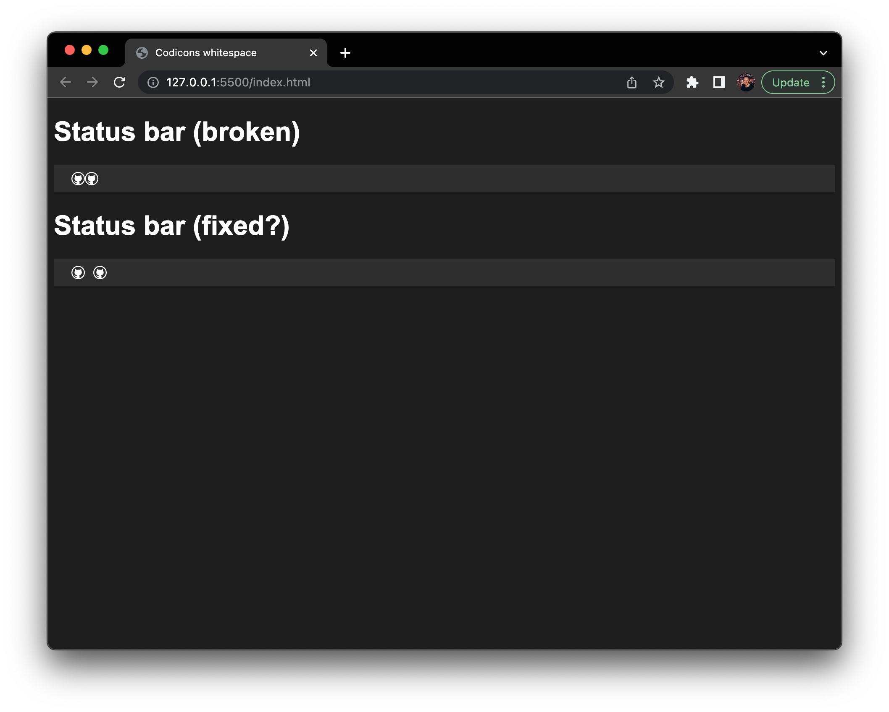

# Codicons whitespace solution

This is a potential solution to this [VS Code bug](https://github.com/microsoft/vscode/issues/145852).

To test this demo:

- Clone the repo locally
- Run `npm install`
- Open `index.html`
- Run with VS Code live server